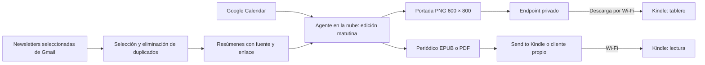

# Kindle Newspaper — diagnóstico y plan

Revisión: 28 de septiembre de 2026, actualizada con la preferencia de funcionamiento en la nube. Objetivo: reutilizar este Kindle como tablero y como periódico matutino de IA y tecnología, a partir de las newsletters recibidas en Gmail y la agenda de Google Calendar. The Rundown AI es la referencia editorial indicada; todavía no se ha comprobado qué suscripciones están en la cuenta.

**Resultado:** el dispositivo es un candidato viable. Hay una ruta documentada para modificarlo conservando su firmware actual. La instalación y el funcionamiento autónomo todavía deben probarse en esta unidad. Un agente en la nube prepara el contenido; el Kindle lo descarga por Wi-Fi. El Mac se necesita únicamente para la preparación inicial si elegimos modificar el Kindle, no como servidor diario.

**Decisión del usuario: no hacer ningún respaldo.** Se elimina esa tarea y su condición de aceptación. No se ha realizado respaldo. La indicación no se interpreta como una orden de ejecutar un borrado ahora.

**Experiencia requerida:** el Kindle debe amanecer mostrando la nueva portada por sí solo, como un periódico que llega cada mañana. El objetivo principal es el tablero autónomo, no la mera recepción de un documento en la biblioteca. Propuesta de interacción: portada al iniciar, toque para avanzar por las páginas, regreso sencillo a portada y salida de mantenimiento separada. Se conserva la edición completa en el dispositivo para leer sin conexión. Durante el uso normal se busca evitar la navegación por la interfaz de Amazon. El arranque, la suspensión y la sustitución del salvapantallas requieren validación real en esta unidad.

## Diagnóstico de la unidad conectada

| Dato | Resultado | Evidencia |
| --- | --- | --- |
| Conexión | Amazon Kindle por USB; volumen `/Volumes/Kindle` | IORegistry y montaje de macOS |
| Modelo | Kindle básico de 7.ª generación, 2014; KT2/BASIC | Prefijo USB `90C6`, contrastado con el catálogo de modelos |
| Firmware declarado por el dispositivo | `Kindle 5.12.2.2 (379151 038)` | Lectura de `/Volumes/Kindle/system/version.txt` |
| Resolución de trabajo | 600 × 800 px, vertical | Cabeceras de dos capturas PNG existentes en el dispositivo |
| Volumen accesible | 3.27 GB; aproximadamente 2.88 GB libres | Consulta del sistema de archivos; unidades decimales |
| Contenido visible | 2,078 archivos; 369,697,280 bytes, aproximadamente 370 MB | Inventario de metadatos, excluyendo índices de macOS; no se copiará |
| Modificaciones anteriores | No aparecen los marcadores habituales revisados en la raíz | Esto no demuestra que nunca haya tenido jailbreak |
| Batería, Wi-Fi y registro Amazon | Pendientes de verificar en el Kindle | No inferidos a partir del cable USB |

La identificación procede del mapeo `C6 → KindleBasic → KT2` en el [catálogo de KindleModding](https://github.com/KindleModding/kindlemodding.github.io/blob/main/static/models_json_generator.py). Amazon sigue publicando **5.12.2.2** como última versión de este modelo; no hace falta actualizarlo para este plan. [Versiones oficiales de Amazon](https://digprjsurvey.amazon.com/csad/help/node/GKMQC26VQQMM8XSW?theme=light).

Esta revisión lee la versión y los metadatos que expone USB. No es una extracción del firmware binario ni de las particiones internas. No se inspeccionó el contenido de libros, notas o capturas. No se enviaron comandos de escritura, reinicio, borrado o instalación al Kindle. Los archivos de este informe se guardan en el Mac.

## Qué significa “limpiarlo”

El restablecimiento de fábrica elimina información de cuenta, ajustes y contenido local. No convierte el Kindle en una pantalla genérica ni sustituye su sistema por Glanceboard. [Explicación de Amazon](https://www.aboutamazon.com/news/devices/hard-reset-kindle).

El usuario ha descartado el respaldo. La primera prueba puede hacerse conservando el estado actual. Después se puede retirar contenido local o preparar un reset si el objetivo incluye borrar cuenta y ajustes, teniendo definido el método de recepción: Send to Kindle requiere registro Amazon; el cliente propio de tablero no depende de ese servicio. No se formatea el volumen desde Utilidad de Discos ni se borran carpetas internas a ciegas.

## Orden de trabajo propuesto

1. **Preparar la edición en la nube.** Configurar un agente programable, conectar Gmail y Google Calendar y generar una primera edición a demanda. No crear todavía una rutina diaria hasta validar la entrega y fijar la hora.
2. **Prueba de legibilidad y recepción.** Preparar una página de prueba a 600 × 800 con agenda y tres titulares ficticios claramente marcados. Probar la entrega inalámbrica del PDF o EPUB al lector original, o de PNG al cliente de tablero una vez instalado. Ajustar letra, contraste y márgenes en la pantalla real.
3. **Preparar la modificación.** Comprobar carga estable, navegador experimental, Wi-Fi y estado de registro. Conservar 5.12.2.2. Elegir una única guía vigente y registrar la versión exacta de los paquetes antes de instalarlos.
4. **Jailbreak candidato: WinterBreak2.** La matriz actual incluye KT2 y este firmware, y no exige registro Amazon. Su guía utiliza Wi-Fi y el navegador experimental. Esto establece compatibilidad documental, no éxito garantizado en este aparato. [Matriz de compatibilidad](https://github.com/KindleModding/kindlemodding.github.io/blob/main/static/jailbreaks.json), [guía WinterBreak2](https://kindlemodding.org/jailbreaking/WinterBreak2/).
5. **Validar después del reinicio.** Comprobar ejecución real de una aplicación compatible y el estado del bloqueo de actualizaciones. Seguir el flujo vigente de instalación; no mezclar paquetes de tutoriales antiguos. La guía actual ofrece KOReader mediante KPM. [Instalación de KOReader](https://kindlemodding.org/jailbreaking/whats-next/getting-koreader/).
6. **Añadir ambos modos y depurar contenido.** Instalar el cliente de tablero y el lector que se hayan verificado. Retirar únicamente el contenido local acordado, sin copia de respaldo conforme a la instrucción del usuario. Mantener una forma sencilla de salir del tablero y volver al lector.
7. **Ensayo de autonomía.** Con el Mac apagado y sin cable de datos, probar una actualización programada, pérdida y recuperación de Wi-Fi, reinicio del Kindle y caída del servicio cloud. Medir consumo y comprobar despertar desde reposo antes de considerar terminado el tablero. El cable quedaría sólo para recargar cuando haga falta.

## Entrega por Wi-Fi sin Mac

| Modalidad | Trabajo en la nube | Recepción en el Kindle | Límite a probar |
| --- | --- | --- | --- |
| Periódico para abrir y leer | Generar EPUB/PDF y enviarlo por Send to Kindle desde un remitente autorizado | Sincronizar la biblioteca por Wi-Fi | Entrega no equivale a apertura automática; posibles verificaciones de envío |
| Tablero que aparece actualizado | Generar PNG 600 × 800 y publicarlo en un endpoint privado | Cliente instalado tras jailbreak consulta por Wi-Fi, descarga y pinta la pantalla | Despertar, HTTPS, refresco y consumo deben comprobarse en este KT2 |

Amazon documenta la entrega inalámbrica de documentos desde remitentes autorizados y puede pedir confirmar ciertos envíos por correo. Hay que verificar esa condición antes de confiar en una rutina desatendida. [Envío por email](https://digprjsurvey.amazon.com/csad/help/node/G7NECT4B4ZWHQ8WV), [formatos aceptados](https://digprjsurvey.amazon.co.uk/csad/help/node/G5WYD9SAF7PGXRNA), [verificación de envíos](https://digprjsurvey.amazon.co.uk/csad/help/node/G98WYFZBRHWGZACA).

La segunda modalidad responde al objetivo de Glanceboard. La comunicación puede iniciarla el Kindle, por lo que no hace falta abrir puertos en el router de casa. El dispositivo sólo necesita acceso a su edición, no credenciales de Gmail o Calendar. El agente también puede producir EPUB/PDF para el modo lectura desde la misma edición.

Como referencia de cliente, [kindle-dash](https://github.com/pascalw/kindle-dash) descarga PNG y contempla suspensión entre actualizaciones. Su autor lo probó en Kindle 4 NT; no debe instalarse asumiendo compatibilidad directa con nuestro KT2. Sirve para estudiar el mecanismo y adaptar una prueba al modelo identificado.

**Grok Bot es un candidato concreto.** Su documentación afirma que ejecuta rutinas en una computadora cloud y continúa trabajando con el portátil cerrado. La plantilla The Morning Newspaper de Karen X. Cheng usa correo y calendario y está orientada a impresión; habría que adaptar la salida al Kindle. No se ha importado, contratado ni configurado. [Grok Bot](https://x.ai/bot), [plantilla oficial](https://x.ai/bot/marketplace/bots/the-morning-newspaper), [página de Karen](https://newspaper.karenx.com/).

También se puede construir el mismo flujo con un servicio cloud programado y una API de IA. El requisito es ejecución remota, acceso autorizado a las fuentes y un mecanismo estable de publicación/entrega; no depende de un proveedor de modelos específico.

## Comparación de costes de operación

Precios consultados el 28 de septiembre de 2026, en dólares estadounidenses y antes de impuestos. No se ha contratado nada. La elección queda pendiente; se prioriza evitar una suscripción costosa para una única edición al día.

| Opción | Precio publicado o estimación | Implicación para el periódico |
| --- | --- | --- |
| Grok Bot con Cursor Pro | Desde US$20/mes | Incluye uso semanal; puede haber cargos por uso adicional |
| Grok Bot con SuperGrok | Desde US$30/mes | Si ya existe una suscripción elegible, revisar acceso antes de contratar otra |
| ChatGPT Work cloud | Plus US$20/mes; puede aprovecharse un plan compatible existente | Rutina cloud documentada; consume cupo compartido con Codex y necesita integrar la publicación al Kindle |
| API OpenAI + servicio cloud propio | Ejemplo: US$6.95/mes; objetivo inicial US$7–10 | Estimación con límites de uso, una edición diaria y sin ilustraciones generadas por IA |

Los precios de Grok Bot y la facturación adicional constan en [su página oficial](https://x.ai/bot) y [Cursor Pricing](https://cursor.com/pricing). Para OpenAI, [precios de ChatGPT Work/Codex](https://learn.chatgpt.com/docs/pricing) y [ejemplo de investigación diaria con Gmail y calendario](https://learn.chatgpt.com/use-cases/daily-work-brief). Work puede continuar con el Mac apagado, pero estas páginas no prueban una entrega nativa a Kindle: todavía necesitamos la integración. API se factura aparte de la suscripción ChatGPT.

**Ejemplo calculado de API:** GPT-6 Luna, tarifa Standard de contexto corto, US$0.10 por millón de tokens de entrada y US$0.50 por millón de salida. Suponiendo un total diario de 100,000 tokens de entrada entre todas las llamadas (incluidos resultados de búsqueda y contexto repetido) y 10,000 tokens facturables de salida (incluido razonamiento), 30 días cuestan US$0.45 en texto. Cinco llamadas diarias a web search, a US$10/1,000 llamadas, añaden US$1.50. Total IA: US$1.95/mes. Es un escenario de cálculo, no consumo medido ni garantía de calidad. [Tarifas API oficiales](https://developers.openai.com/api/docs/pricing), [modelo](https://developers.openai.com/api/docs/models/gpt-6-luna).

**Infraestructura:** reservar US$5/mes para Workers Paid. El cron prepara la edición y el endpoint la entrega al Kindle; Browser Run renderiza la plantilla a PNG y R2 conserva los archivos dentro de sus cuotas incluidas. Un prototipo podría caber en los planes gratuitos, pero no se promete: Workers Free limita la CPU a 10 ms por invocación. [Workers](https://developers.cloudflare.com/workers/platform/pricing/), [límites](https://developers.cloudflare.com/workers/platform/limits/), [Browser Run](https://developers.cloudflare.com/browser-run/pricing/), [R2](https://developers.cloudflare.com/r2/pricing/).

US$0.45 + US$1.50 + US$5 = **US$6.95 mensuales** bajo esos supuestos. Más investigación, reintentos, un modelo más caro o generación de ilustraciones cambian el coste. Propuesta: limitar llamadas, tokens y reintentos desde la aplicación, registrar gasto por edición y evaluar calidad con varias ediciones antes de fijar el presupuesto. La portada tipográfica se compone mediante una plantilla; no necesita pagar por generar una imagen con IA.

**Excepción importante:** KindleBreak, un método distinto, excluye expresamente el firmware 5.12.2.2. No se debe elegir sólo porque el número parezca estar dentro de un rango genérico. [Guía KindleBreak](https://kindlemodding.org/jailbreaking/Legacy/KindleBreak/). WinterBreak original queda como alternativa documentada si falla WinterBreak2, pero exige registro Amazon. [Guía WinterBreak](https://kindlemodding.org/jailbreaking/WinterBreak/).

## El periódico de Gmail y Google Calendar

La siguiente arquitectura es una propuesta propia; aún no está implementada ni conectada a las cuentas.

**Selección.** Primero inventariar las newsletters recientes y elegir remitentes concretos. Usar esa lista o una etiqueta existente de Gmail como filtro. La ventana de cada edición cubre desde el último cierre, con solapamiento y control de IDs para recuperar correos tardíos sin repetir noticias. No depender de que un correo esté sin leer: leerlo en el teléfono no debe sacarlo del periódico.

**Edición e investigación.** Extraer los artículos del cuerpo del correo, separar patrocinios y agrupar noticias equivalentes. El agente puede seguir enlaces relevantes y contrastar anuncios con fuentes primarias para ampliar lo que traen las newsletters. Conservar remitente, fecha, enlace al correo y fuentes originales. La IA resume sólo material recuperado; si sólo dispone de un extracto, indicarlo. No completar noticias con conocimiento supuesto del modelo. Propuesta inicial: español, 5–8 noticias, una selección breve de herramientas y una lectura recomendada; cantidades configurables.

**Agenda.** Consultar Google Calendar en modo lectura. Mostrar los eventos de hoy y un anticipo breve de mañana, respetando cancelaciones, recurrencias, eventos de todo el día y la zona `America/Mexico_City`. Los horarios se componen directamente desde los datos, sin pedir a un generador de imágenes que los dibuje.

**Portada.** Fecha, tres titulares principales y próximas citas. Una columna, alto contraste y texto grande. El resto del contenido se pagina: una pantalla de 600 × 800 no debe intentar contener un periódico entero. Las ilustraciones serían opcionales y subordinadas a la legibilidad.

**Conexiones.** Para el servicio independiente: OAuth de Gmail con `gmail.readonly` y permisos de lectura de eventos/lista de calendarios. El filtro de newsletters se aplica en nuestra aplicación; Gmail no limita ese permiso a una etiqueta. Guardar credenciales en el servicio cloud, fuera del repositorio y del Kindle. [Permisos de Gmail](https://developers.google.com/workspace/gmail/api/auth/scopes), [permisos de Calendar](https://developers.google.com/workspace/calendar/api/auth). Hay herramientas de ambos conectores disponibles en esta sesión; todavía no se han probado sus cuentas ni leído correos o eventos. La conexión del agente cloud se configura aparte. Si se elige envío por email, su permiso de envío y remitente se configuran por separado de la lectura de newsletters.

**Actualización.** Hora matutina configurable; no se ha programado ninguna tarea. El servidor prepara y valida una edición completa antes de sustituir la anterior. El Kindle descarga una imagen validada y sólo refresca si cambia. La portada incluye fecha de edición y hora de actualización. Si falla una fuente, se identifica la ausencia; si falla la red, se conserva la última edición. La marca temporal permite reconocer que la pantalla ha quedado desactualizada incluso si el Kindle no despierta.

El proceso diario corre en cloud y no depende de que el Mac esté encendido. Hay que probar dos automatizaciones por separado: que el agente publique la edición a tiempo y que el Kindle despierte y la muestre. La frecuencia de actualización y el consumo se decidirán con una prueba física; no se presupone que una tarea periódica despierte el Kindle.

## Cómo aprovechar Glanceboard

Glanceboard usa principalmente un ESP32-S3 PhotoPainter de seis colores; su firmware corresponde a ese hardware. También documenta una alternativa Raspberry Pi. El patrón servidor → imagen → pantalla encaja con este proyecto. [Repositorio oficial](https://github.com/google-gemini/glanceboard).

El código revisado fija un lienzo de 800 × 480 y genera noticias desde conocimiento general del modelo, con titulares de relleno si falta información. También realiza llamadas externas a proveedores de IA. Por ello reutilizaría ideas de calendario y programación, adaptando el render a grises y reemplazando el módulo de noticias por la ingesta de Gmail. [Código del servidor](https://github.com/google-gemini/glanceboard/blob/main/server/app.py).

Para mostrar PNG directamente, **FBInk** ofrece soporte para Kindle; habrá que integrar y probar suspensión, refresco y salida al lector. [FBInk](https://github.com/NiLuJe/FBInk). Para leer el periódico, **KOReader** admite EPUB/PDF. [KOReader](https://github.com/koreader/koreader). También puede probarse el periódico como PDF en el lector original por USB antes del jailbreak; eso no demuestra aún actualización autónoma de pantalla.

## Cuándo considerar terminado el proyecto

- Instrucción de no respaldar respetada y contenido de limpieza definido.
- Una portada real legible en esta unidad, sin cortes ni texto demasiado pequeño.
- Una edición hecha con newsletters seleccionadas, sin duplicados y con enlaces verificables.
- Agenda coincidente con Google Calendar, incluyendo un evento recurrente y uno de todo el día.
- Actualización matutina comprobada físicamente con el Mac apagado, sin cable de datos, y recuperación tras desconexión.
- Reinicio y cambio entre tablero y lector funcionando.
- Consumo medido durante un ensayo de 24–48 horas; última edición conservada ante fallos.

**Estado al cerrar esta revisión:** diagnóstico y plan cloud terminados. Respaldo excluido por decisión del usuario. Limpieza, jailbreak, conexiones a las cuentas, generación del periódico y automatización pendientes. No se ha instalado ni reseteado el Kindle.
