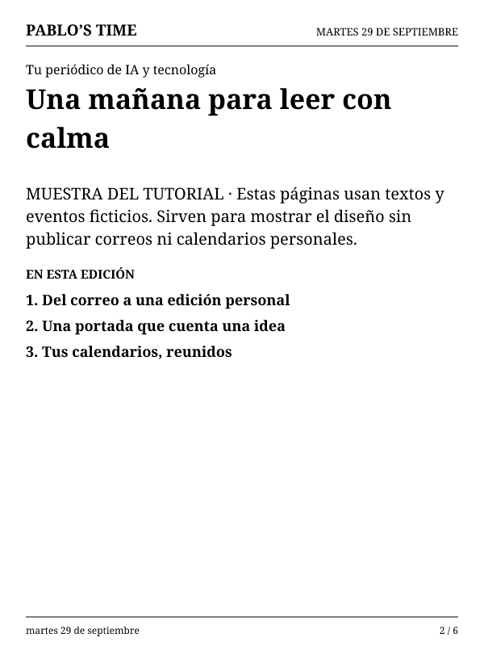
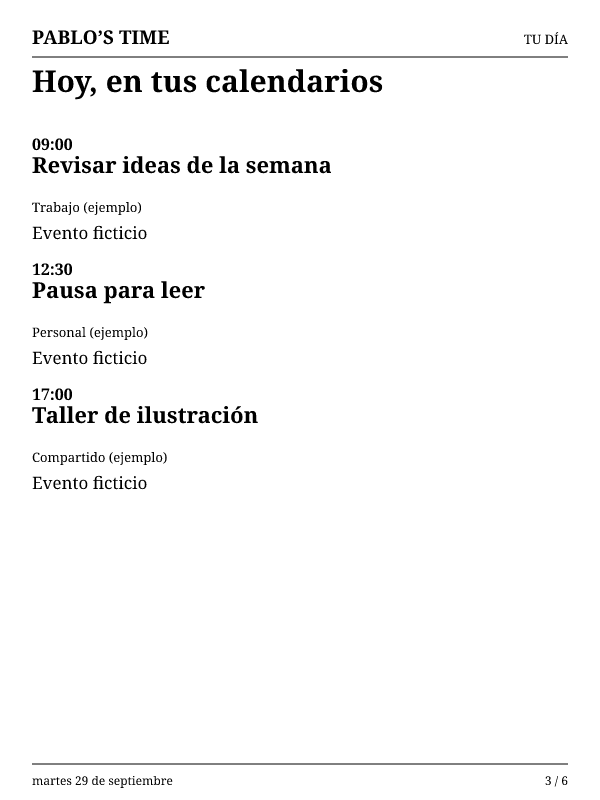
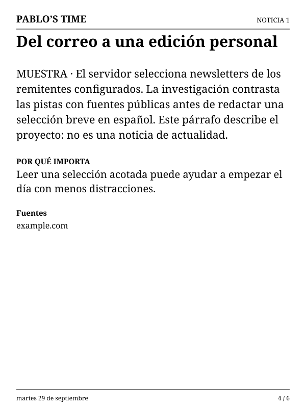
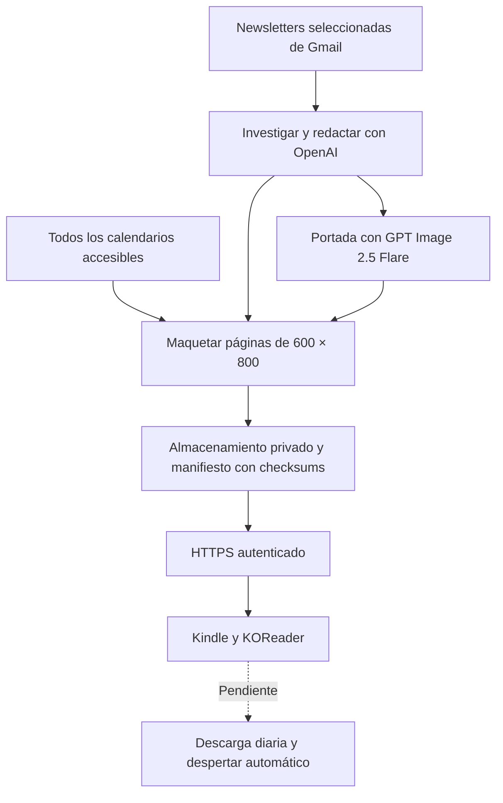

# Pablo’s Time

### Convierte un Kindle compatible en tu periódico personal de la mañana

Newsletters de IA y tecnología, noticias contrastadas, una portada ilustrada diferente y tus calendarios en una edición para tinta electrónica. La idea: empezar el día leyendo, sin abrir el teléfono.

<p align="center">
  
</p>

**Tutorial de un prototipo funcional, no un instalador universal.** Se han probado generación cloud, lectura de Gmail y todos los calendarios, una portada recibida por Wi-Fi y apertura de la edición en KOReader. **La descarga diaria dentro del lector y el despertar automático a las 08:00 todavía están pendientes.** Conectar cualquier Kindle por USB no basta para completar esas funciones.

## Empieza aquí

1. [Dale este prompt a Codex](docs/EMPEZAR-CON-CODEX.md).
2. [Sigue el tutorial de implementación](docs/TUTORIAL.md).
3. [Configura tu portada y dirección de arte](docs/PORTADA.md).
4. [Consulta la configuración del servidor](cloud/README.md).
5. [Revisa qué funciona y qué falta](#qué-está-comprobado).

Necesitas acceso al repositorio. Actualmente es **privado**: compártelo con colaboradores autorizados o prepara una publicación separada; este README no lo hace público.

## Así se ve

Estas son **capturas de las páginas renderizadas**, no fotografías del dispositivo. La portada es el diseño real generado con Image Gen; los interiores de esta galería usan **textos y eventos ficticios**. No contienen correos ni agenda personal.

| Portada ilustrada | Apertura de la edición |
| --- | --- |
|  |  |
| Agenda combinada · muestra | Noticia · muestra |
|  |  |

Puedes reproducir estas imágenes sin claves ni consumo de API:

```sh
cd cloud
npm ci
node scripts/render-tutorial.js
```

El script escribe solamente los cuatro PNG de `docs/images/`. La ilustración original y su prompt están en [assets/covers](assets/covers/).

## Cómo funciona



La agenda se incorpora directamente: **no se envía al modelo de noticias ni al generador de imágenes**. El dispositivo necesita solo su credencial de lectura; las claves de Google y OpenAI se quedan en el servidor.

## Qué necesitas

- Kindle compatible, cable de datos USB y Wi-Fi. Primero identifica **modelo y firmware**.
- Mac para la preparación probada; Windows/Linux requieren adaptar rutas y montaje.
- Codex o un agente de programación con acceso al repositorio y herramientas locales.
- Node.js 22, npm y Git para el servidor; Python 3 para utilidades de preparación.
- Cuenta OpenAI con acceso API, facturación y permisos para Responses, búsqueda e imágenes.
- Proyecto Google Cloud con Gmail API y Calendar API, cliente OAuth web y las cuentas del propietario.
- Vercel y **Vercel Blob privado**, o una adaptación equivalente del backend a otro proveedor.

**No necesitas compartir contraseñas ni pegar claves en el chat.** Codex debe ayudarte a configurarlas localmente o como secretos del hosting.

### Equipo en el que se probó

| Componente | Valor observado |
| --- | --- |
| Dispositivo | Kindle Basic 2014, 7.ª generación, KT2 |
| Firmware | 5.12.2.2 |
| Pantalla | 600 × 800, vertical, escala de grises |
| Jailbreak utilizado en esta unidad | WinterBreak2 / jb.sh 1.3.7; ver registro histórico |
| Lector | KOReader 2026.07.1, distribución `kindlepw2` |
| Preparación | macOS, volumen `/Volumes/Kindle` |
| Zona horaria | America/Mexico_City |
| Generación del servidor | Cron 12:00 UTC, aproximadamente 06:00 CDMX |
| Objetivo de lectura | 08:00 CDMX; despertar físico aún no verificado |

**Esto no es una matriz de compatibilidad.** El procedimiento de jailbreak debe verificarse con las guías oficiales vigentes para cada dispositivo. Los scripts de este repositorio contienen controles específicos de KT2/5.12.2.2 y no deben ejecutarse a ciegas en otros equipos.

## Qué está comprobado

Estado documentado al **29 de septiembre de 2026**:

| Función | Evidencia y límite |
| --- | --- |
| Jailbreak y ejecución tras reinicio | Verificados en la unidad KT2 del proyecto |
| Pantalla de tinta electrónica | FBInk dibuja PNG de 600 × 800 |
| Entrega Wi-Fi | Portada descargada por HTTPS con certificado y checksum comprobados; confirmada visualmente |
| Gmail | Lectura real de newsletters seleccionadas por remitente |
| Calendar | Servicio cloud devuelve eventos del principal y compartidos; permiso de lista de calendarios confirmado |
| Noticias reales | Primera edición publicada; URLs restringidas a fuentes recuperadas, no garantía automática de exactitud |
| Portada ilustrada | Diseño con Image Gen y prueba API completada con GPT Image 2.5 Flare |
| Edición multipágina | CBZ abierto en KOReader; salida normal registrada. Edición corregida de 7 páginas restaurada por USB |
| Recuperación de borrado | Documento restaurado; al terminar se configura volver a portada |
| Nueva edición diaria en el lector | **Pendiente de implementación y prueba** |
| Despertar y mostrar portada a las 08:00 | **Pendiente de prueba física** |
| Funcionamiento autónomo 24–48 horas | **Pendiente** |

No confundir la portada recibida por Wi-Fi con la edición corregida cargada por USB, ni una ejecución manual del servidor con una mañana automática.

## Portadas y personalización

La dirección visual es una revista editorial ilustrada inspirada en *The New Yorker*, con arte original: **Pablo’s Time**, metáfora basada en las noticias, fecha visible, una línea breve de portada y alto contraste para tinta electrónica.

- Modelo de imágenes del servidor: `gpt-image-2.5-flare`.
- Calidad: `medium`; salida original solicitada: `1024x1536`, PNG.
- Adaptación final: `600x800`, escala de grises, fondo blanco y encaje sin recortar.
- Una portada por edición publicada; caché privada diaria para reutilizar resultados ya generados.
- El prompt pide variar el concepto; no existe todavía un detector de repetición entre días.
- [Especificación completa, prompt y archivos a editar](docs/PORTADA.md).

Nombre, resolución, zona horaria, horario y modelos todavía están repartidos entre varios archivos: no hay un panel de personalización. El tutorial indica exactamente dónde cambiarlos.

## Privacidad y costes

Cada instalación debe usar **sus propias** cuentas, secretos y despliegue. No reutilices la URL del proyecto, los identificadores de Google, las cuentas del propietario ni archivos privados de una instalación anterior.

Los ejemplos de este tutorial son ficticios. No subas `.local/`, `.env.local`, ediciones personales, tokens, capturas de consentimiento con secretos, números de serie completos ni libros. Las notas históricas incluyen contexto de la instalación original: revísalas antes de distribuir un fork públicamente.

La cuenta de ChatGPT y la API tienen facturación separada. El coste de una edición incluye investigación, redacción, búsqueda, imagen, ejecución y almacenamiento. **Todavía no hay un coste mensual medido ni una tarifa por edición verificada.** Hay pruebas con registros de uso, no una garantía de “unos centavos”. Configura los controles de gasto del proveedor y mide varias ediciones.

## Mapa del repositorio

| Ruta | Contenido |
| --- | --- |
| [docs/TUTORIAL.md](docs/TUTORIAL.md) | Recorrido de preparación, cloud, cuentas, Kindle y pruebas |
| [docs/EMPEZAR-CON-CODEX.md](docs/EMPEZAR-CON-CODEX.md) | Prompt de inicio para una instalación nueva |
| [docs/PORTADA.md](docs/PORTADA.md) | Dirección de arte, prompt, formatos y límites |
| [cloud/README.md](cloud/README.md) | Variables, permisos, endpoints y publicación |
| [cloud/src](cloud/src) | Servidor, editorial, portada, calendario y render |
| [scripts](scripts) | Pruebas y lanzadores específicos del dispositivo auditado |
| [docs/REGISTRO.md](docs/REGISTRO.md) | Historial cronológico; no es una receta para repetir todos los pasos |
| [docs/JAILBREAK.md](docs/JAILBREAK.md), [docs/REPARACION.md](docs/REPARACION.md), [docs/VERIFICACION.md](docs/VERIFICACION.md) | Referencias históricas de la unidad original |
| [docs/ARQUITECTURA.md](docs/ARQUITECTURA.md), [PLAN-KINDLE.md](PLAN-KINDLE.md) | Diseño y decisiones históricas; el estado actual está arriba |

## Referencias

[Glanceboard](https://github.com/google-gemini/glanceboard) · [KindleModding](https://kindlemodding.org/) · [KOReader](https://github.com/koreader/koreader) · [FBInk](https://github.com/NiLuJe/FBInk)

Los componentes externos conservan sus licencias. Las fuentes Noto Serif incluyen [SIL OFL](cloud/fonts/LICENSE). Este repositorio aún no tiene una licencia general de distribución: acceso al tutorial no equivale a una licencia de código abierto.
