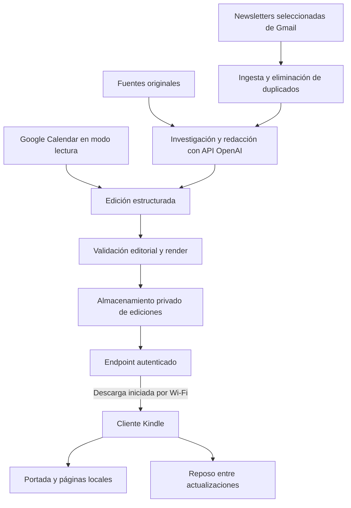

# Arquitectura del periódico

Estado: propuesta de implementación. Fecha inicial: 28 de septiembre de 2026.

## Objetivo

La pantalla del Kindle debe amanecer mostrando una nueva portada, como un periódico entregado cada mañana. La investigación, la redacción y la composición ocurren en la nube. El Kindle descarga la edición por Wi-Fi, muestra la portada y conserva las páginas para leerlas sin conexión. El Mac puede permanecer apagado.

El dispositivo identificado es un KT2 de 2014 con firmware 5.12.2.2 y pantalla de 600 × 800 píxeles. La autonomía de este diseño depende de validar físicamente su despertar, conectividad, refresco y consumo después del jailbreak.

## Componentes propuestos

| Componente | Responsabilidad |
| --- | --- |
| Programador cloud | Iniciar la edición con margen respecto de la hora de entrega y registrar el resultado. |
| Ingesta | Recuperar únicamente los remitentes o etiquetas elegidos y los calendarios autorizados. |
| Agente editorial | Seleccionar, contrastar y resumir noticias, conservando fuentes y fechas. |
| Compositor | Crear la portada y las páginas con una plantilla tipográfica fija. |
| Publicador | Hacer visible únicamente una edición completa y validada. |
| Endpoint privado | Entregar el manifiesto y los archivos al dispositivo autorizado. |
| Cliente Kindle | Despertar, descargar, verificar, actualizar la pantalla y volver a reposo. |

El proveedor de alojamiento y el runtime concreto quedan pendientes de selección y prueba. Se requieren programación remota, gestión de secretos, almacenamiento privado y un entorno que pueda renderizar las páginas. El presupuesto y sus supuestos están en [el plan](../PLAN-KINDLE.md#comparación-de-costes-de-operación).

## Producción de una edición

1. **Abrir una ventana de recopilación.** Tomar las newsletters desde el último cierre, con solapamiento y control de identificadores para recuperar mensajes tardíos. El estado leído/no leído no decide qué entra.
2. **Extraer y agrupar.** Separar noticias y patrocinios, identificar enlaces y agrupar coberturas del mismo anuncio.
3. **Investigar.** Consultar fuentes originales para las noticias seleccionadas. El texto recibido es material de consulta, no instrucciones para el agente ni autorización para ejecutar acciones.
4. **Redactar.** Crear resúmenes en español con enlaces y fechas. Señalar cuando sólo se dispone de un extracto; no rellenar ausencias con titulares inventados.
5. **Agregar agenda.** Resolver eventos cancelados, recurrencias y eventos de todo el día a partir de los datos de Calendar. Usar `America/Mexico_City` como zona inicial configurable.
6. **Componer y validar.** Renderizar PNG de 600 × 800 para portada y páginas. La paginación debe respetar tamaño mínimo de texto, márgenes y contraste. Puede añadirse EPUB/PDF como formato de lectura, sin convertirlo en requisito del primer prototipo.
7. **Publicar.** Guardar una revisión completa y actualizar el manifiesto de la edición disponible sólo después de verificar los archivos.

La selección inicial de medios se hará con el usuario sobre sus suscripciones reales. Todavía no se han conectado Gmail o Calendar para esta implementación.

## Entrega al Kindle

La comunicación la inicia el dispositivo: **pull por Wi-Fi**. No requiere recibir conexiones entrantes ni abrir puertos del router doméstico. El cliente consulta un manifiesto privado con identificador de edición, fecha, revisión, archivos y comprobaciones de integridad. Sólo descarga y refresca cuando hay una revisión nueva.

La descarga debe escribirse en una ubicación temporal y validarse antes de sustituir la edición local. Si falla, se conserva la anterior. La portada siempre muestra su fecha para que una pantalla desactualizada resulte reconocible, incluso cuando el dispositivo no haya podido despertar.

El objetivo de bajo consumo es despertar cerca de la entrega, conectar Wi-Fi, comprobar y descargar la edición, actualizar la pantalla y volver a reposo. El mecanismo de despertar y la frecuencia de reintento se elegirán después de medirlos en el KT2; no se presupone que un temporizador común siga funcionando durante la suspensión.

La compatibilidad HTTPS, los certificados y la hora del dispositivo deben verificarse con el cliente instalado. El diseño exige transporte protegido: no se propone desactivar la validación de certificados para compensar un cliente antiguo.

## Interfaz propia

La portada será la pantalla principal, con fecha, titulares principales y próximas citas. Las noticias completas se distribuyen en pantallas sucesivas; no se intenta reducir una página de periódico impreso al tamaño del Kindle.

Las interacciones previstas son avanzar, retroceder y volver a portada. Debe existir una salida de mantenimiento para recuperar el control del dispositivo. La sustitución del salvapantallas, la convivencia con el sistema original y el comportamiento al reiniciar se comprobarán por separado.

El primer prototipo priorizará imágenes paginadas para que portada y lectura compartan el mismo diseño. FBInk ya inicializa y muestra una portada sintética en esta unidad, confirmada por el usuario. La navegación paginada, la descarga y el despertar siguen pendientes; KOReader continúa como candidato para lectura, sin instalación verificada.

## Seguridad y privacidad

- Guardar credenciales de OpenAI y tokens OAuth de Google en el gestor de secretos del servicio cloud.
- Solicitar permisos de lectura para Gmail y Calendar. El filtro de newsletters es una regla de la aplicación; no limita por sí mismo el alcance del permiso de Gmail.
- Dar al Kindle una credencial revocable y restringida a descargar su propia edición, sin acceso a Gmail, Calendar o la API de OpenAI.
- Proteger manifiestos, portadas, páginas y cachés: pueden contener citas y otros datos personales.
- Excluir del repositorio credenciales, tokens, contenido de newsletters, eventos, ediciones personales, diagnósticos con identificadores completos y archivos copiados del dispositivo.
- Registrar tiempos, estados y costes sin volcar contenido personal en los logs. Definir una retención corta y configurable para ediciones y registros cloud.
- Tratar instrucciones encontradas dentro de correos o páginas web como datos no confiables. El agente no enviará correos ni modificará calendarios como parte del flujo editorial.

El usuario ha indicado expresamente que **no se realicen respaldos**. La documentación de acciones no debe incorporar copias del contenido del Kindle. La conservación de la edición operativa anterior para tolerar fallos es parte del lector, no una copia de los archivos personales existentes.

## Fallos y presupuesto

Una fuente ausente debe indicarse en la edición o excluirse con un estado registrado. Un fallo de generación no debe sustituir la última edición válida. La actualización del dispositivo debe poder reintentarse con límites, sin mantener Wi-Fi activo indefinidamente.

La aplicación limitará llamadas de modelo, búsquedas, tokens y reintentos por edición. Se medirá el coste real antes de fijar un presupuesto estable. La maquetación se genera mediante plantilla; no requiere una llamada de generación de imágenes para cada página.

Las pruebas deben distinguir cuatro estados: edición generada, edición publicada, edición descargada y portada observada en la pantalla. Un resultado correcto en el servidor no confirma por sí solo la entrega física.

## Criterios de aceptación

| Prueba | Evidencia necesaria |
| --- | --- |
| Ejecución propia tras jailbreak | Una aplicación compatible funciona en el KT2 y sigue disponible después de reiniciar. |
| Portada legible | Inspección en la pantalla real, sin cortes, con fecha visible y tamaño de texto cómodo. |
| Entrega matutina | Una portada nueva aparece a la hora acordada, con el Mac apagado y sin cable USB. |
| Despertar desde reposo | La actualización ocurre después de un periodo de suspensión real, sin intervención manual. |
| Navegación sin conexión | Es posible recorrer las páginas descargadas y volver a portada con Wi-Fi desconectado. |
| Recuperación de red | La última edición se conserva durante una interrupción y la nueva llega cuando vuelve el Wi-Fi. |
| Fallo de publicación | Una edición incompleta o inválida no sustituye la edición válida. |
| Reinicio | El dispositivo recupera el modo periódico y conserva una salida de mantenimiento. |
| Agenda | Horas, recurrencias y eventos de todo el día coinciden con Calendar. |
| Calidad editorial | Noticias sin duplicados, fuentes accesibles y ausencias señaladas. |
| Autonomía | Ensayo físico de 24–48 horas con consumo, despertares y resultados registrados. |

Hasta completar estas pruebas, el funcionamiento autónomo permanece **pendiente de validación**. El procedimiento y los resultados se mantendrán en [JAILBREAK.md](JAILBREAK.md) y [REGISTRO.md](REGISTRO.md).
