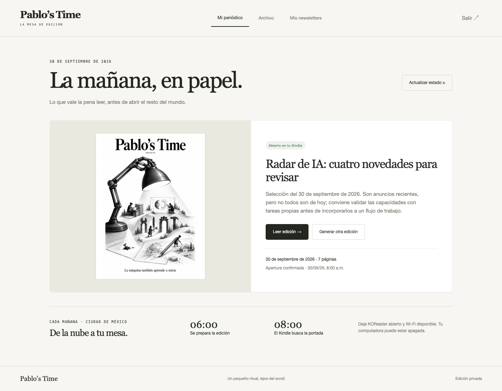
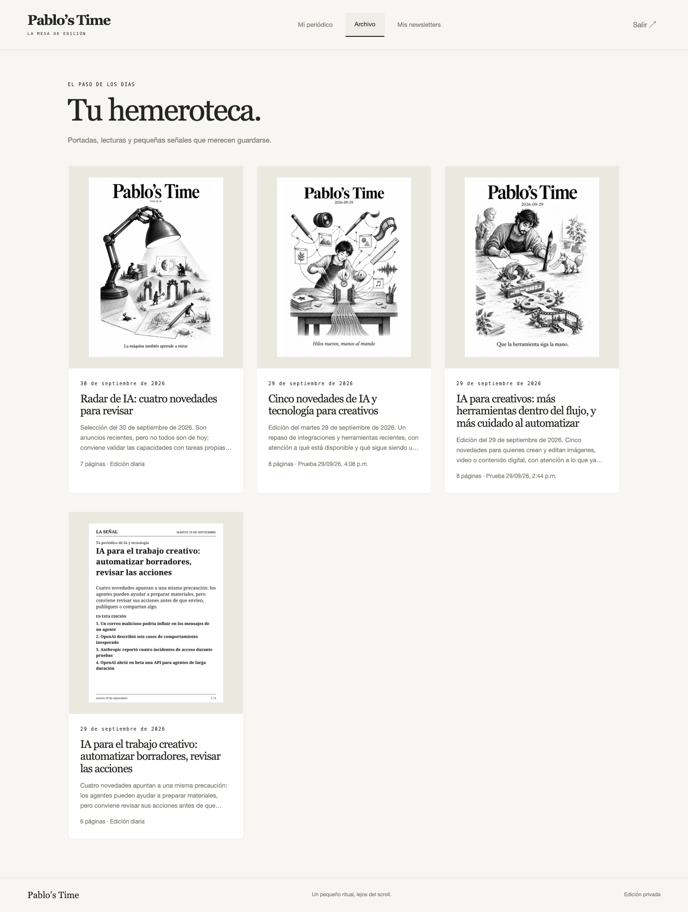
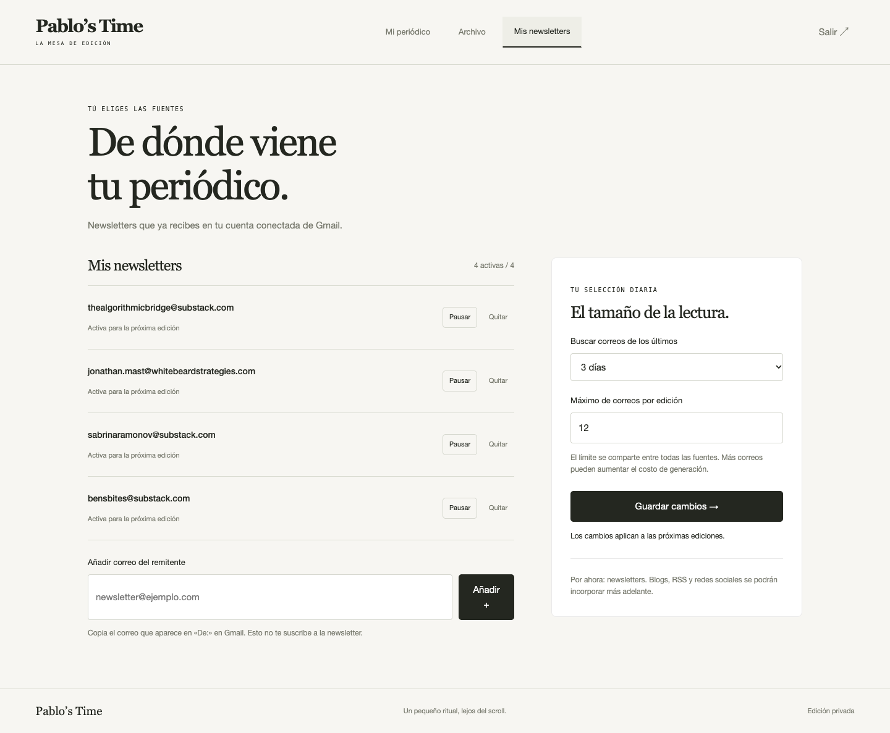

# Tu mesa de edición

Cada instalación dispone de un panel privado en `https://TU-PROYECTO.vercel.app/panel`. La raíz redirige al panel. Una copia independiente por propietario significa una URL, Blob privado, cuentas de Google y credenciales propias. Esta versión **no es un servicio multiusuario compartido**: no mezcles usuarios en el mismo almacenamiento.

## Qué puedes hacer

- **Mi periódico:** portada y resumen de la última publicación; abrir todas las páginas; actualizar el estado del Kindle. La fecha permite distinguir una edición anterior de la de hoy.
- **Archivo:** publicaciones diarias y revisiones de prueba, con fecha, portada y resumen. Navegación por lotes de 12. Los documentos publicados se conservan; los borradores temporales se limpian según `RETENTION_DAYS`.
- **Mis newsletters:** añadir remitentes de Gmail, pausar, reactivar o quitar; revisar de 1 a 7 días; limitar a 1–20 correos totales por edición. Se requiere al menos una fuente activa, con hasta 20 remitentes. Guardar aplica a la próxima generación sin despliegue y no altera publicaciones anteriores.
- **Generar otra edición:** confirmación explícita antes de consumir API y publicar una revisión nueva. No actualiza físicamente el Kindle hasta su siguiente consulta. Si se interrumpe la conexión, consultar el estado antes de repetir.

La interfaz todavía no cambia cuentas Google, calendarios, estilo de portada ni hora de entrega. Tampoco acepta URLs de blogs, RSS o redes: introduce el correo real del remitente que aparece en Gmail. No suscribe a nuevas newsletters. Estas ampliaciones requieren conectores y controles específicos.

## Preparar el acceso con Codex

1. Completa el despliegue normal y sus variables, especialmente `PUBLIC_URL` (origen HTTPS exacto), `ADMIN_TOKEN` y `ENCRYPTION_KEY`.
2. Desde `cloud/`, con variables privadas disponibles, ejecuta:

   ```sh
   node --env-file=.env.local scripts/setup-panel.js
   ```

   El script crea una clave aleatoria y la guarda en `../.local/panel-access.txt` con permisos restringidos. Nunca la imprime ni la subas al repositorio. En producción, Codex puede inyectar esas variables desde la configuración privada de la instalación sin crear un archivo compartido.
3. Abre `/panel`, introduce esa clave y guárdala en tu gestor de contraseñas. Repetir el script cambia la clave y revoca las sesiones anteriores.
4. Verifica el archivo y guarda la lista de remitentes. Hasta el primer guardado se utiliza `NEWSLETTER_SENDERS`; después manda la configuración del panel.

## Seguridad y almacenamiento

La clave del panel es distinta de las credenciales de administración y dispositivo. Se guarda como hash scrypt con sal en Blob privado. La sesión está cifrada/autenticada, dura siete días y usa cookie HttpOnly, SameSite=Strict y Secure en Vercel. Los cambios requieren origen exacto y cabecera de solicitud; las páginas, imágenes y API requieren sesión. No hay tokens en la URL ni en localStorage. Hay un límite básico de intentos de acceso por instancia; un servicio multiusuario necesita autenticación y límites distribuidos adicionales.

Las fuentes se guardan en revisiones inmutables `settings/newsletters/00000001.json`. La API rechaza guardar sobre una versión desactualizada: recarga y revisa antes de guardar otra vez. `NEWSLETTER_SENDERS` es únicamente la configuración inicial, no un segundo panel paralelo.

Los recibos futuros se guardan por edición en `receipts/`. Las publicaciones anteriores a esta función pueden carecer de ese registro. «Abierto» es la confirmación que envía el cliente, no prueba de que una persona lo haya leído. La vista principal conserva el último recibo y el último disparo por alarma.

El archivo es privado y crece con el uso; su almacenamiento también cuenta para el consumo de Vercel Blob. No es posible reconstruir desde el panel ediciones que ya se hubieran eliminado antes de activar la conservación.

## Validación

`npm test` comprueba autenticación, separación respecto del token del Kindle, protección de cambios contra otros orígenes, preferencias persistidas, conflictos entre guardados, validación de remitentes y conservación del archivo. La prueba visual debe revisar escritorio/móvil, lectura de varias páginas, guardado y recarga de fuentes.

## Recorrido visual

Capturas reales del panel publicado el 30 de septiembre de 2026. No contienen contraseñas, tokens ni páginas de agenda.

### Mi periódico



### Archivo



### Mis newsletters



La prueba en navegador verificó lectura de páginas, alta y eliminación de un remitente ficticio en desarrollo, guardado y persistencia al recargar, y ausencia de desbordamiento a 390 px. En producción se verificaron acceso privado, cuatro publicaciones visibles y guardado de los cuatro remitentes existentes sin alterarlos. Las 21 pruebas del servidor pasaron. No se generó una edición pagada adicional para probar el diseño.
